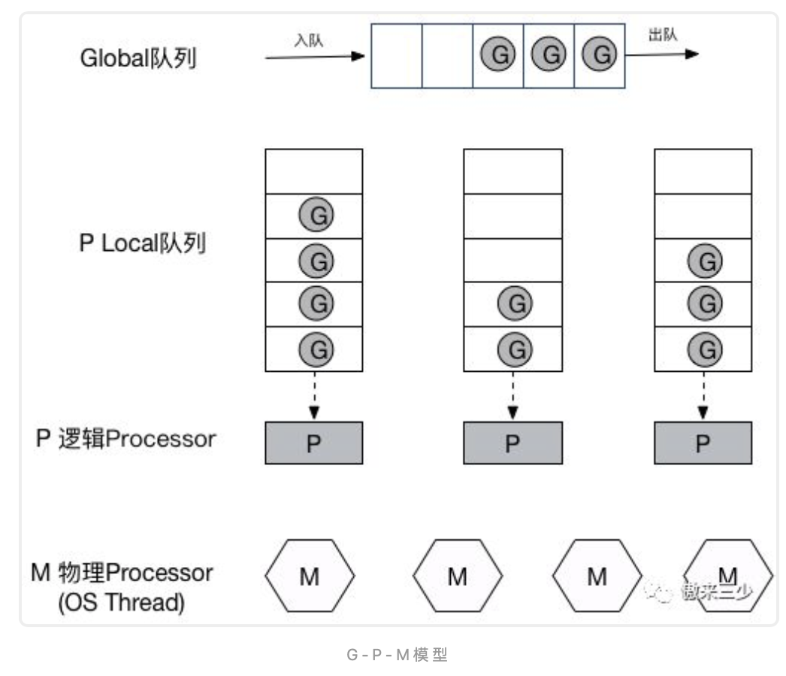

### Go G-P-M模型

----
    - 进程和线程的核心是隔离和并发
       进程是系统分配资源的基本单位
       线程为执行的基本单元
    - goroutine是一个与其他goroutines 并发运行在同一地址空间的go函数或方法， 一个运行的程序由一个或多个goroutine组成
    - GOMAXPROCS是限制CPU数， 本质上就是限制并行数, 即同时执行数量， 执行单元为线程，即限制最大并行线程数量

----
    goruntine的优势在于并行和非常低的资源使用
        每一个OS线程都有一个固定大小的内存块(通常为2MB)来做栈，这个栈会用来存储当前正在被调用或挂起的函数的内部变量. 
        goroutine初识内存仅为2kb， 切换只需三个寄存器的值修改 - PC / SP / DX
   
----
    Goroutine
    1. gotoutine的栈采用动态扩容的方式，初始值仅为2KB。由golang自己的调度器Go Schedulerl来调度
    2. GC会周期性将不再使用的内存回收，收缩栈空间
    3. grountine通过Precessor(逻辑处理器)与os线程绑定， 
       P可以看作是一个抽象资源或上下文环境， 一个P绑定一个OS线程， golang中把OS线程抽象成一个数据
       结构M（Machine）, G实际由M通过P来进行调度的
    4. 从G的成面来看，P提供了G运行的上下文环境和资源，P就是它的"CPU"
    
----
    Go调度器基本结构
    · Goroutine: 对应一个G结构体，G存储Goroutine的运行堆栈，状态以及任务函数
    · P:Processor逻辑处理器，对G来讲P相当于CPU核，G只有在P的local runq(run队列中)才能被调度
        对M来讲，P提供了执行环境Context(如内存分配状态mcache, 任务队列G)， P的数量决定系统最大并行G的数量
        （前提：物理CPU核数 >= P的数量），P的数量由用户设置的GOMAXPROCS决定，但是不论GOMAXPROCS设置为多大，P的数量最大为256
    · M：Machine(OS线程抽象)，绑定有效的P之后，进入schedule循环；
        schedule循环的机制大致是从Global队列、P的local队列以及wait队列中获取G，切换到G的执行栈上执行G的函数
        调用goexit做清理工作并回到M，如此反复。M并不保留G状态，这是G可以跨M调度的基础，M的数量是不定的，
        由Go Runtime调整，为了防止创建过多OS线程导致系统调度不过来，目前默认最大限制为10000个
        
----
    work-stealing调度算法
    * 每个P维护一个G的本地队列
    * 当一个G被创建，或变为可执行状态时，把它放到P的可执行队列中
    * 当一个G在M里执行结束后，P会从队列中把G取出； 如果P的队列为空，M就随机选择另一个P，从其可执行的G队列中取走一半

----
    G-P-M模型调度
    * Go调度器工作时会维护两种任务队列
        一种是Global任务队列
        一种是P的Local任务队列 
    * 通过go关键字创建goroutine时，会优先放入P的本地队列。 为了运行goroutine, M需要持有一个P，接着启动一个OS线程
      循环从P的本地队列里取出一个goroutine执行。 
      当M执行完当前P的local队列里所有的G后，P先尝试从Global队列寻找G来执行。如果Global队列为空，就随机挑选另一个P，从它的队列中取出一半的G
      
----
    goroutine被阻塞的情况下运行另外一个goroutin
    * 用户态阻塞/唤醒
        当goroutine因为channel操作或网络I/O阻塞时，对应的G会被放置到某个wait队列（如channel的waitq),该G的状态由_Grunning变为_Gwaiting,
        而M会跳过该G并获取执行下一个G， 如果没有可以执行的G， 则M解绑P，进入sleep状态； 
        当阻塞的G被另一段G2唤醒(channel的通信)， G被标记为runnable, 并尝试加入G2的run next, 然后再是P的local队列，globle队列
        
    * 系统调用阻塞
         · 当G被阻塞在某个系统调用上时，此时G阻塞在_Gsyscall状态, M也处于block on syscall状态， 此时M可被抢占调度； 执行该G的M与P解绑，
         P则尝试与其他idle的M绑定，继续执行它队列中的其他G； 如果没有空闲的M，而p的本地队仍然有G需要执行，则创建一个新的M。
         · 当系统调用完成后， G会尝试获取一个空闲的P，进入它的本地队列恢复执行，如果没有idle的P，则G会标记为runnable加入到Global队列