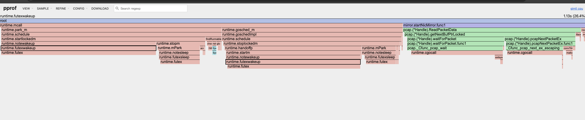

#### 记录一次CPU利用率排查思路

##### 1. top查看当前cpu使用情况


##### 2. 追踪进程的使用情况

```bash
# -f 跟踪子线程，-c 统计汇总，持续5秒后 Ctrl+C
timeout 5 strace -p 27705 -c -f

# 查看各线程CPU占用
top -H -p 27705
```

 

. 这样就能看到 这5秒内主要在调用什么系统函数（如果大量是 epoll_wait、read、write 说明在处理网络请求，如果是 futex 说明线程锁竞争严重）。

从 strace 数据来看：
核心瓶颈：futex 锁竞争
总共 20386 次系统调用中，futex 占了 10967 次，其中 1815 次失败（errors）。这意味着大量线程在尝试获取锁时失败，然后不断重试，CPU 就这样被消耗掉了。

|系统调用|占比|含义|
|---|---|---|  
|futex 54.5%|线程同步/锁|瓶颈所在，1815次争抢失败|
|nanosleep|19.6%|线程休眠可能是锁抢不到后的退避等待

##### 3. 对比cpu核数和应用的线程数

```bash
# 看服务器有几个核
nproc

# 看  当前线程数
ls /proc/27705/task | wc -l
```

##### 4. # 看网卡每秒收包数

```bash
# ifconfig/ip 看收发包量
ip -s link show

# 看网卡每秒收包数
cat /proc/net/dev
sleep 5
cat /proc/net/dev
对比前后网卡接收包pps, 如果pps很小说明本身的性能问题
```


##### 4. 通过连接来检查后段响应
```bash
# 看 ESTABLISHED 和 CLOSE_WAIT 数量
ss -tnp | grep 2938627 | grep -c ESTAB
ss -tnp | grep 2938627 | grep -c CLOSE-WAIT
大量等待中的请求，连接不释放就会疯狂吃 CPU。
```

##### 5. go应用使用pprof查看cpu profile
```
# 抓30秒的CPU profile
curl http://localhost:<port>/debug/pprof/profile?seconds=30 -o cpu.pprof

go tool pprof -http=:8080 cpu.pprof
```


瓶颈根因：CGO 调用 libpcap 导致的 Go 调度器震荡
核心调用链（占 CPU 83%）：
|占比|调用路径|说明|
|---|---|---|
|26.4%|futex → futexwakeup → startlockedm → schedule → park_m|调度器唤醒 locked M|
|22.7%|futex → futexwakeup → startm → handoffp → stoplockedm|调度器 handoff P|
|14.0%|cgocall → pcap_wait → waitForPacket → ReadPacketData → startNicMirror|等待抓包|
9.3%|cgocall → pcap_next_ex → ReadPacketData → startNicMirror|读取数据包
6.1%+4.7%|futex → futexsleep → notesleep → mPark → stopm/stoplockedmM|线程休眠

总结: 
 (基于 libpcap) 通过 CGO 抓包。每次调用 pcap_wait 和 pcap_next_ex 都是 CGO 调用，Go 的 CGO 机制要求将当前 goroutine 锁定到一个 OS 线程（locked M）。当 CGO 调用阻塞时（等待网卡数据包），Go 调度器必须做 handoff——把 P（处理器）从被锁定的 M 上摘下来交给其他 M。等 CGO 返回时，又要把 P 抢回来。

 结合代码在小流量下cpu调用过高
 ```go
 go// bufferTimeout := 2000 * time.Millisecond
bufferTimeout := 1 * time.Millisecond -> 
// 改后（推荐）
bufferTimeout := 100 * time.Millisecond 
```
1. bufferTimeout = 1ms → pcap 每隔 1ms 就超时返回一次
2. 每次 ReadPacketData() 调用走 CGO（pcap_next_ex / pcap_wait）
3. CGO 调用时，goroutine 被锁定到 OS 线程（代码里还显式调了 runtime.LockOSThread()）
4. 每 1ms 超时返回后，拿到 NextErrorTimeoutExpired，直接 continue 又立刻调 ReadPacketData()
5. 这意味着每秒约 1000 次 CGO 调用，每次都触发 Go 调度器的 M/P handoff
6. 在低流量时，几乎每次调用都是超时返回，全部 CPU 浪费在 CGO 调度震荡上
