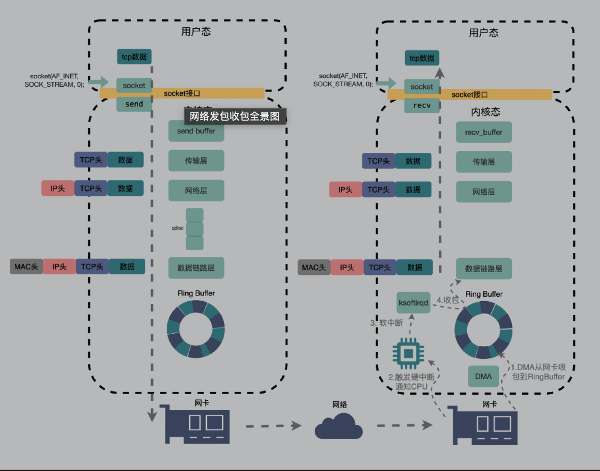
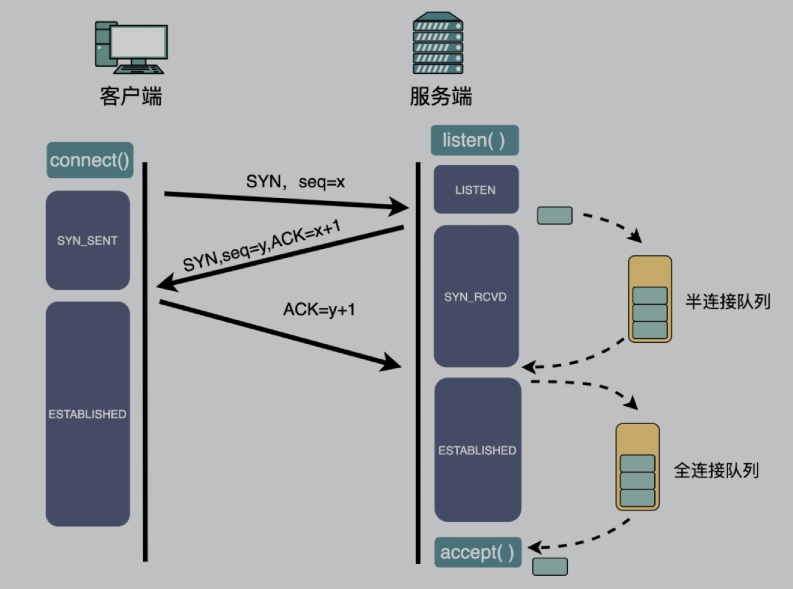

#### 丢包排查

##### 数据包整个链路
* 先放一张网络通信链路
    
```text
    数据包通过socket由用户态发送到内核态send buffer, 顺着传输层，网络层，经过流量控制Queueing Disciplines
    进入数据链路层，再通过ring buffer发送到物理层的网卡
```

##### 建立链接丢包

```text
    tcp三次握手，在第一次握手后，服务端会先建立半链接队列。
    在客户端确认后，半链接升级到全链接，暂存到全链接队列。
    当应用程序执行accept()时将其取走。
```
* tcp建立链接的队列满的时候会出现丢包
```shell
#查看全链接队列溢出次数
netstat -s | grep overflowed
#半链接队列溢出
netstat -s | grep -i "SYNs to LISTEN sockets dropped"
```

##### 流量控制丢包
* txqueuelen 流控队列长度    
* TX dropped大于0的时候，有可能发送流控丢包
```shell
$ ifconfig eth0
eth0: flags=4163<UP,BROADCAST,RUNNING,MULTICAST>  mtu 9001
        inet 172.31.33.213  netmask 255.255.240.0  broadcast 172.31.47.255
        inet6 fe80::849:79ff:fee5:f268  prefixlen 64  scopeid 0x20<link>
        ether 0a:49:79:e5:f2:68  txqueuelen 1000  (Ethernet)
        RX packets 250219986  bytes 92969726906 (86.5 GiB)
        RX errors 0  dropped 0  overruns 0  frame 0
        TX packets 201786201  bytes 80221092468 (74.7 GiB)
        TX errors 0  dropped 0 overruns 0  carrier 0  collisions 0
```

##### 网卡丢包
* ring buffer过小导致丢包
  1. 查看RX overruns, 溢出指标
```shell
   $ ifconfig eth0
      RX errors 0  dropped 0  overruns 0  frame 0
```
   2. 使用ethtool查看丢包
```shell
   $ ethtool -S eth0 | grep rx_queue_o_drops
```
3. ethtool查看网卡配置
```shell
   $ ethtool -g eth0
    Ring parameters for eth0:
    Pre-set maximums:
    RX:		4096
    RX Mini:	0
    RX Jumbo:	0
    TX:		4096
    Current hardware settings:
    RX:		512
    RX Mini:	0
    RX Jumbo:	0
    TX:		1024
```
* 网卡性能不足
```shell
$ ethtool eth0

Settings for eth0:
	Supported ports: [ ]
	Supported link modes:   10000baseT/Full
	Supported pause frame use: No
	Supports auto-negotiation: No
	Supported FEC modes: Not reported
	Advertised link modes:  Not reported
	Advertised pause frame use: No
	Advertised auto-negotiation: No
	Advertised FEC modes: Not reported
	Speed: 10000Mb/s
	Duplex: Full
	Port: Other
	PHYAD: 0
	Transceiver: internal
	Auto-negotiation: off
Cannot get wake-on-lan settings: Operation not permitted
	Current message level: 0x00000007 (7)
			       drv probe link
	Link detected: yes
```
* 通过sar命令从网络接口层查看数据包收发情况
  * txkB/s是指当前每秒发送的字节（byte）总数，rxkB/s是指每秒接收的字节（byte）总数
  * txkB + rxkB 与Speed比较
```shell
$ sar -n DEV 1
Linux 3.10.0-1127.19.1.el7.x86_64      2022年07月27日     _x86_64_    (1 CPU)

08时35分39秒     IFACE   rxpck/s   txpck/s    rxkB/s    txkB/s    rxcmp/s   txcmp/s  rxmcst/s
08时35分40秒      eth0      6.06      4.04      0.35    121682.33   0.00    0.00     0
```

##### 接受缓冲区丢包
使用tcp socket进行编程时，内核会分配一个发送缓冲区和接收缓冲区
* 查看缓冲区大小命令(分别对应缓冲区的最小值，默认值和最大值 min、default、max)
```shell
#接收缓冲区
$ sysctl net.ipv4.tcp_rmem
net.ipv4.tcp_rmem = 4096	87380	6291456
#发送缓冲区
$ sysctl net.ipv4.tcp_wmem
```

##### 网络间丢包
使用ping查看
```shell
$ ping host
```
mtr命令可以查看到你的机器和目的机器之间的每个节点的丢包情况, 在icmp下，只关注最后一行 %0表示没有丢包
```shell
$ mtr -r www.baidu.com

Start: 2022-10-31T17:56:12+0800
HOST: ip-172-31-33-213.cn-northwe Loss%   Snt   Last   Avg  Best  Wrst StDev
  1.|-- ec2-52-83-0-101.cn-northw  0.0%    10    0.8  20.1   0.8  81.4  31.7
  2.|-- ???                       100.0    10    0.0   0.0   0.0   0.0   0.0
  3.|-- ???                       100.0    10    0.0   0.0   0.0   0.0   0.0
  4.|-- ???                       100.0    10    0.0   0.0   0.0   0.0   0.0
  5.|-- ???                       100.0    10    0.0   0.0   0.0   0.0   0.0
  6.|-- ???                       100.0    10    0.0   0.0   0.0   0.0   0.0
  7.|-- 100.65.10.129              0.0%    10    0.8   0.6   0.3   2.4   0.7
  8.|-- 52.82.194.37               0.0%    10    1.1   1.3   1.0   3.8   0.9
  9.|-- 52.82.194.122              0.0%    10    2.2   2.5   1.2   9.3   2.4
 10.|-- 52.82.194.131              0.0%    10    1.1   1.9   1.0   4.8   1.4
 11.|-- 211.138.56.161             0.0%    10    2.0   1.9   1.8   2.0   0.1
 12.|-- 221.183.64.57             20.0%    10    1.2   1.2   1.2   1.4   0.1
 13.|-- 221.183.56.117            50.0%    10   32.7  32.3  32.0  32.7   0.3
 14.|-- 221.183.53.182            50.0%    10   31.9  32.7  31.8  35.8   1.8
 15.|-- 39.156.27.5                0.0%    10   32.4  32.4  32.3  32.4   0.0
 16.|-- 39.156.67.17               0.0%    10   48.8  47.1  46.9  48.8   0.6
 17.|-- ???                       100.0    10    0.0   0.0   0.0   0.0   0.0
 18.|-- ???                       100.0    10    0.0   0.0   0.0   0.0   0.0
 19.|-- ???                       100.0    10    0.0   0.0   0.0   0.0   0.0
 20.|-- ???                       100.0    10    0.0   0.0   0.0   0.0   0.0
 21.|-- 39.156.66.18               0.0%    10   27.0  27.0  27.0  27.1   0.0
```